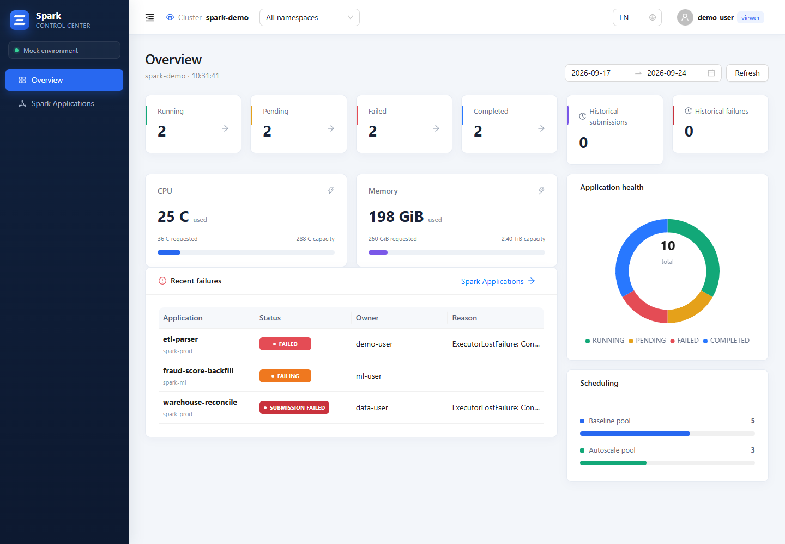
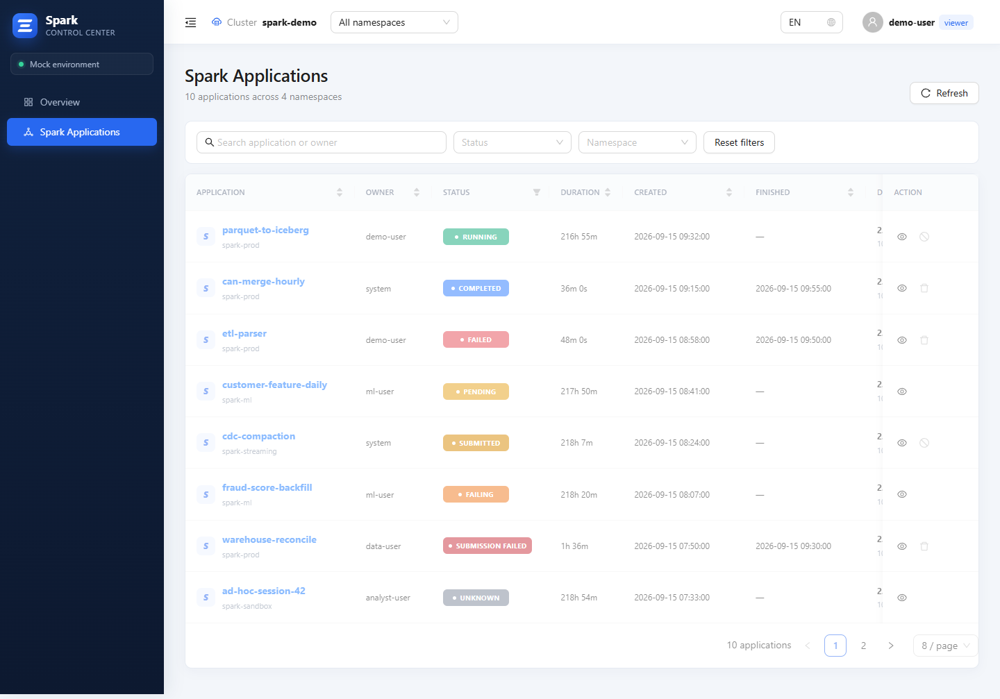
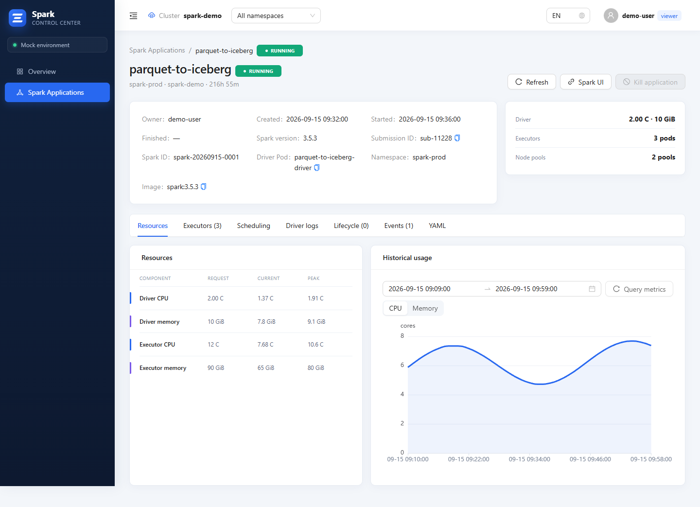
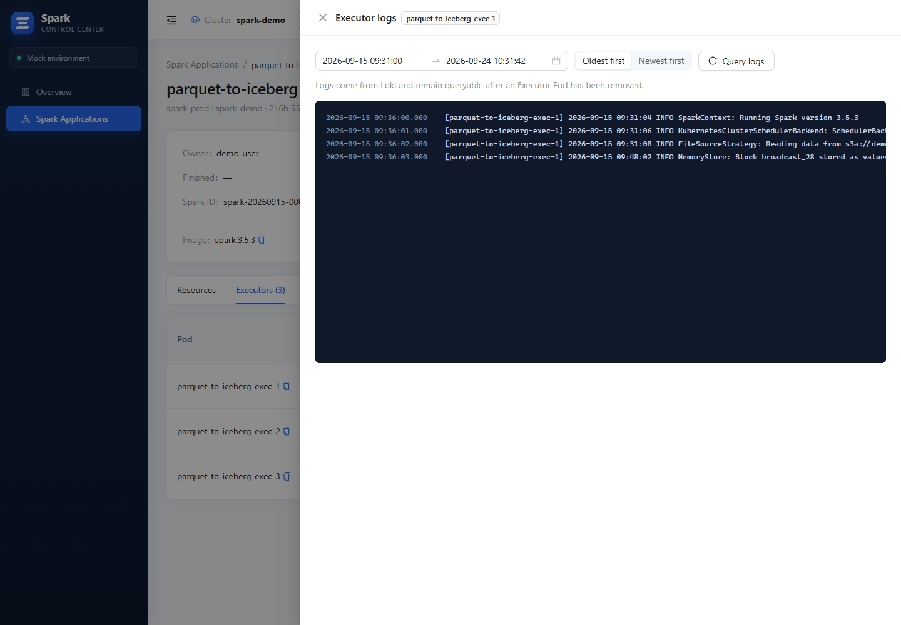
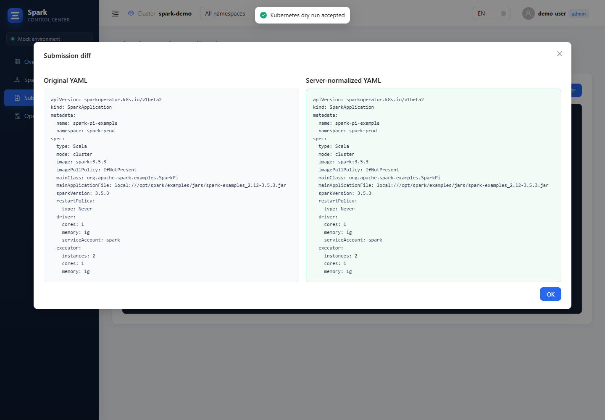

# Spark Control Center

简体中文 · [English](README.md)

Spark Control Center 是面向 Kubernetes 上 Apache Spark 作业的运维控制台，将作业生命周期管理、实时及历史资源指标、Driver UI、Executor 持久化日志、操作审计和权限控制整合为一套可独立部署的应用。

## 核心能力

- 查询指定命名空间中的 SparkApplication，展示状态、Owner、生命周期时间和资源使用情况。
- 查看 Driver/Executor 的申请量、实时用量、峰值、调度信息、Kubernetes 事件、日志、YAML 和可选时间范围的 Prometheus 历史曲线。
- 通过后端代理访问运行中的 Driver Spark UI；终态作业在启用 EventLog 后可跳转 Spark History Server。
- 从 Loki 查询持久化 Executor 日志，即使对应 Pod 已被删除仍可查看。
- 提交 SparkApplication YAML；终止 `RUNNING` 或卡住的 `SUBMITTED` 作业并保留失败 Driver Pod；删除终态记录。
- 提交前调用 Kubernetes 服务端 dry-run 校验，并对比原始 YAML 与服务端规范化清单。
- 从已清理服务端元数据和运行状态的清单克隆或重试作业。
- 通过 Kubernetes Watch 和 SSE 实时推送变更，同时保留定时刷新作为恢复机制。
- 支持 PostgreSQL 本地账号和可选 OIDC/Keycloak 登录，并在前后端同时落实 `viewer`、`admin` 及用户级命名空间权限。
- 使用 PostgreSQL 保存用户、会话、生命周期快照、失败诊断和操作审计。
- 通过内置 Helm Chart 和命名空间级 RBAC 部署。

## 运行截图

| 运行总览 | Spark 作业列表 |
| --- | --- |
|  |  |

| 作业资源与历史曲线 | Executor 持久化日志 |
| --- | --- |
|  |  |



所有截图均使用确定性的 Mock 数据，不包含生产集群地址、账号或凭证。

## 技术架构

- **前端：** React、TypeScript、Vite、Ant Design、ECharts
- **后端：** Go HTTP 服务
- **集成：** Kubernetes Spark Operator API、Prometheus、Loki、PostgreSQL、可选 OIDC
- **部署：** 非 root 容器、Nginx 同源 API 代理、Helm、最小范围 RBAC

浏览器只访问同源 `/api`，Kubernetes、Prometheus、Loki、PostgreSQL 和 OIDC 凭证全部保留在服务端。

## 本地开发

需要 Node.js 22+ 和 npm：

```bash
npm ci
npm run dev
```

默认配置使用浏览器本地 Mock 数据和 Mock 登录。

运行前端验证：

```bash
npm test
npm run build
```

后端验证需要 Go 1.24+：

```bash
cd backend
go test ./...
go vet ./...
```

## 容器镜像

使用不含仓库前缀的名称构建：

```bash
docker build -t spark-control-center:1.1.0 .
docker build -f backend/Dockerfile -t spark-control-center-backend:1.1.0 .
```

GitHub `v1.1.0` Release 提供可由 Docker 直接载入的镜像 tar 文件和打包后的 Helm Chart：

```bash
docker load -i spark-control-center-1.1.0.tar
docker load -i spark-control-center-backend-1.1.0.tar
```

## Helm 部署

默认 values 运行 Mock 前端。真实部署时请复制并修改仅包含占位信息的生产示例：

```bash
cp charts/spark-control-center/examples/values-production.yaml values-production.yaml

helm upgrade --install spark-console ./charts/spark-control-center \
  --namespace spark-console \
  --create-namespace \
  -f values-production.yaml
```

请在私有 values 文件中配置镜像仓库、监控命名空间、PostgreSQL Secret 引用、Prometheus/Loki 地址、Ingress 和可选 OIDC。不要向代码库提交密码、Client Secret、访问令牌、证书、kubeconfig 或生产环境专属 values。

完整接口、安全模型、RBAC 行为、Keycloak 配置和高分辨率 Prometheus 配置见[部署与配置说明](docs/DEPLOYMENT.md)。

## 权限模型

- `viewer`：查看已授权命名空间中的作业、指标、事件、日志、YAML 和 Spark UI，并管理自己的资料。
- `admin`：拥有 viewer 权限，并可在已授权命名空间中提交、终止、删除作业，以及管理审计和用户。管理员可为用户分配命名空间；留空时为兼容现有部署，表示允许全部已配置命名空间。

所有高权限操作都会由后端独立校验，前端隐藏按钮不作为授权依据。

## 安全说明

- 仓库和容器镜像不包含任何生产凭证。
- 密码使用 bcrypt 哈希；随机会话令牌仅以 SHA-256 哈希形式保存。
- 会话使用 HttpOnly/SameSite Cookie，状态变更接口执行同源校验。
- OIDC 使用 Authorization Code Flow + PKCE，并校验 issuer、签名、audience、过期时间、state 和 nonce。
- Kubernetes 权限默认限制在明确配置的命名空间内。

## 许可证

本项目使用 [Apache License 2.0](LICENSE)。
